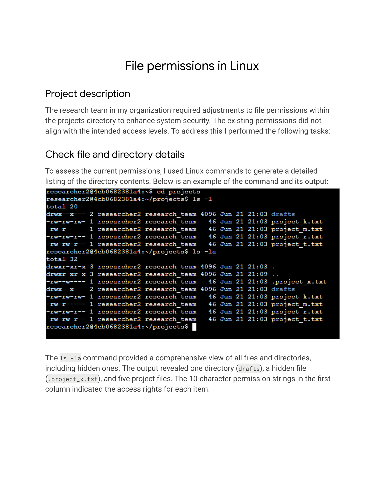
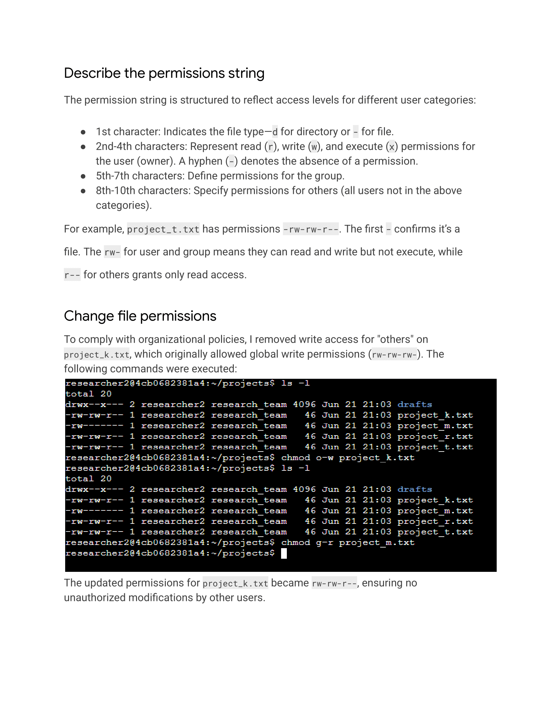
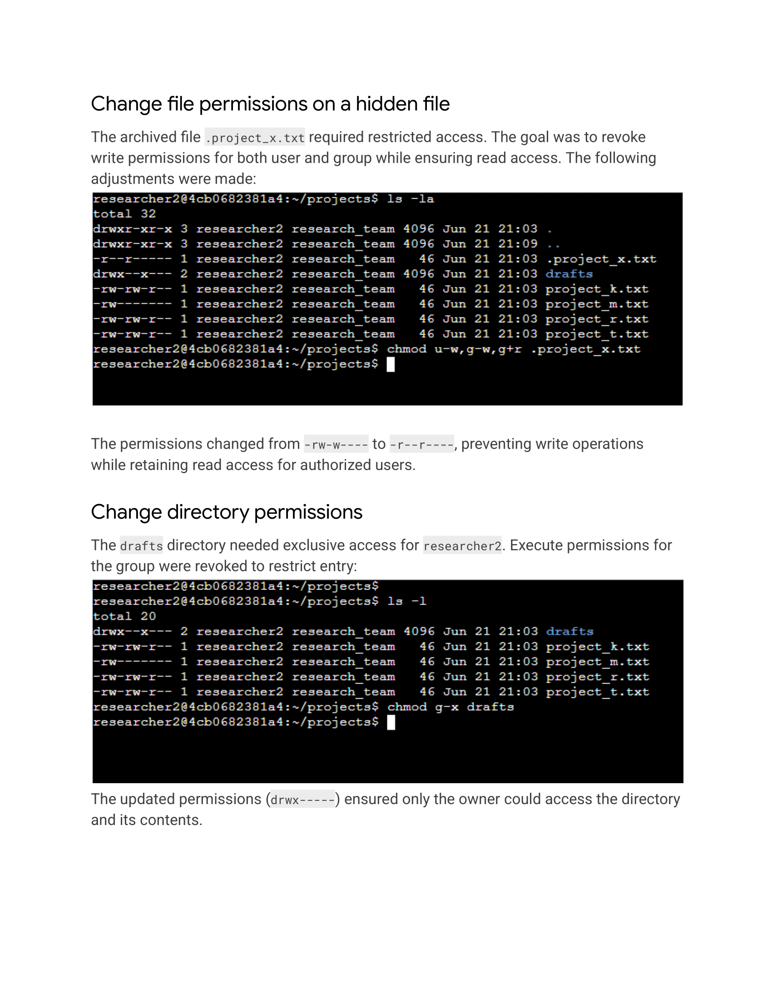
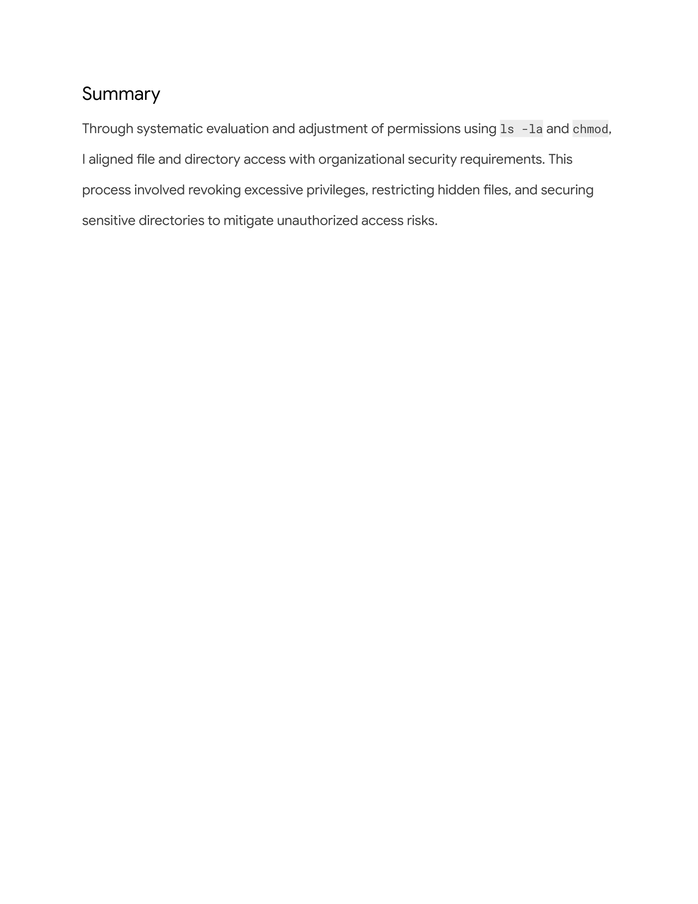

# Using-Linux-commands-to-manage-file-permissions
This activity involves documenting my hands-on experience with Linux commands for managing file permissions in a professional portfolio.
In this activity I will create a portfolio document showcasing my skills in managing Linux file permissions using command-line tools like chmod, chown, and chgrp
## Scenario

Review the scenario below. Then, complete the step-by-step instructions.

You are a security professional at a large organization. You mainly work with their research team. Part of your job is to ensure users on this team are authorized with the appropriate permissions. This helps keep the system secure. 

Your task is to examine existing permissions on the file system. You’ll need to determine if the permissions match the authorization that should be given. If they do not match, you’ll need to modify the permissions to authorize the appropriate users and remove any unauthorized access.

